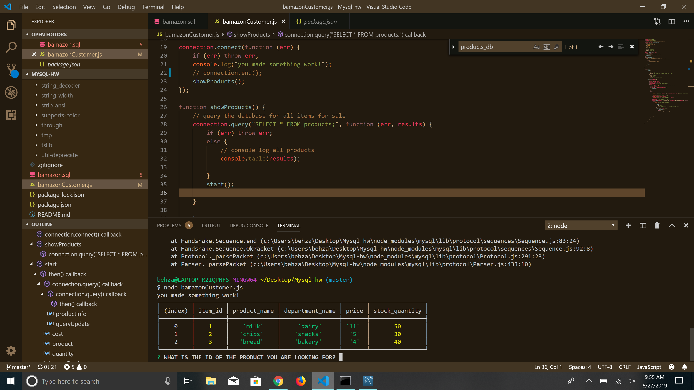

# Mysql-hw

## Program Description
This program uses a MySQL database for customers and managers to interact with. This is a very basic program where customers can purchase items just like purchase something from an online website. In this program, customers may view the products and choose the products they want to purchase. Managers have a few more options, where they can view the products for sale, update inventory, and more. Let's take a look at how a customer interacts with the program.
Ive only gotten around to the bamazonCustomer.js file but having issues with connecting to the database.

## Prerequisites
1. To run the application on your local machine, you will need node.js.
2. In Git Bash/Terminal, clone the repository for this app using this command line: git clone
3. After the cloning is complete, run this command: npm install inquirer mysql
4. To run the customer view, type this command: node bamazonCustomer.js

#### Customer User Interface
Upon running the program, the customer is greeted with three options. They can view the products for sale, make a purchase, or simply exit the program.

## Instructions

### Challenge #1: Customer View (Minimum Requirement)

1. Create a MySQL Database called `bamazon`.

2. Then create a Table inside of that database called `products`.

3. The products table should have each of the following columns:

   * item_id (unique id for each product)

   * product_name (Name of product)

   * department_name

   * price (cost to customer)

   * stock_quantity (how much of the product is available in stores)

4. Populate this database with around 10 different products. (i.e. Insert "mock" data rows into this database and table).

5. Then create a Node application called `bamazonCustomer.js`. Running this application will first display all of the items available for sale. Include the ids, names, and prices of products for sale.

6. The app should then prompt users with two messages.
## Demo

Format: 

   * The first should ask them the ID of the product they would like to buy.
   * The second message should ask how many units of the product they would like to buy.

7. Once the customer has placed the order, your application should check if your store has enough of the product to meet the customer's request.

   * If not, the app should log a phrase like `Insufficient quantity!`, and then prevent the order from going through.

8. However, if your store _does_ have enough of the product, you should fulfill the customer's order.
   * This means updating the SQL database to reflect the remaining quantity.
   * Once the update goes through, show the customer the total cost of their purchase.

- - -
